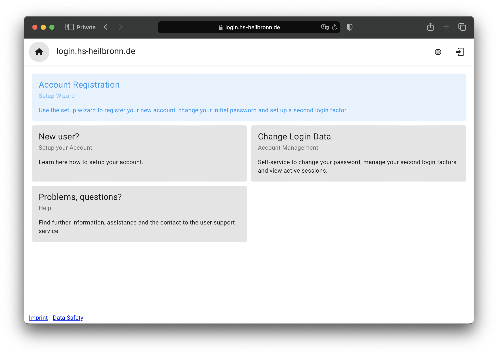
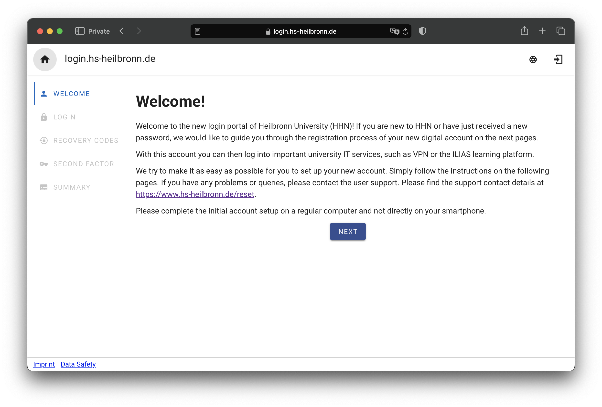

# SSO Welcome/Onboarding

The Onboarding application serves as the front-end interface for setting up new accounts for staff and students at Heilbronn University. A guided wizard guides users through the process of setting up their new university accounts, including registering for second factor authentication.

The Onboarding application is connected to our identity management and single sign-on system based on Keycloak. The setup of this environment is described in more detail in the [sso-docs](https://github.com/HHN/sso-docs) repository.

## Motivation

Following a cyber attack, we rebuilt significant parts of our IT infrastructure. A key part of this rebuild was the implementation of a new single sign-on and identity and access management (IAM) system based on Keycloak.

When we needed to reset the passwords of 10,000 people and introduce mandatory multi-factor authentication, we looked for a solution that would simplify the rollout process.

As we didn't want users to have to click through the Keycloak account management, we developed this application to guide them step by step through the process of setting up their account. The application provides explanations and help, and the Keycloak functionality is transparently integrated. After going through the wizard, users have changed their initial password, set up a second factor (TOTP or FIDO2) and generated emergency recovery codes.

## Features

- **Initial Login:** Users must first log in with their initial password provided by the university's IT service.
- **Guided Assistant:** After initial login, a guided assistant walks users through setting up their new university account.
  - Setting up a secure password
  - Generating emergency recovery codes
  - Registering second-factor authentication
- **Multi-factor Authentication (MFA) Setup:** Users can opt between TOTP and FIDO2 keys for second-factor authentication. All employees at our university are provided with YubiKeys for this purpose.
- **Keycloak Integration:** The application transparently integrates Keycloak features.
- **Multilingual Support:** The application is bilingual and supports both English and German languages to assist native as well as international students and staff.

## Screenshots






## Limitations

In our password instructions, we give tips on creating strong passwords, recommend the use of password managers, and also state that passwords should not be dictionary words. While our initial aim was to strictly adhere to the [NIST 800-63B guidelines on memorized secrets](https://github.com/usnistgov/800-63-3/blob/nist-pages/sp800-63b/sec5_authenticators.md#5111-memorized-secret-authenticators), we have not yet found an effective solution for checking passwords against databases of previously compromised passwords within Keycloak. Although we do filter common passwords in Keycloak through a deny list, this approach is not comprehensive. As a result, our password guidelines also suggest that passwords should use all available character types, including numbers, special characters, upper and lower case letters. We recognise that this is not fully compliant with NIST standards and are actively seeking a better solution.


## Developer Docs

### Project setup

```
# yarn
yarn

# npm
npm install

# pnpm
pnpm install
```

### Compiles and hot-reloads for development

```
# yarn
yarn dev

# npm
npm run dev

# pnpm
pnpm dev
```

### Compiles and minifies for production

```
# yarn
yarn build

# npm
npm run build

# pnpm
pnpm build
```

### Lints and fixes files

```
# yarn
yarn lint

# npm
npm run lint

# pnpm
pnpm lint
```

### Customize configuration

See [Configuration Reference](https://vitejs.dev/config/).
